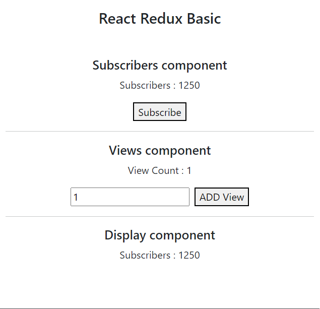

# js-react-redux-basic

## UI Preview



## JS libruary

fro react app

```
npx create-react-app .
```

for redux libruary

```
npm i redux react-redux
```

for redux middleware  
(redux-logger) to show action, state details

```
npm i redux-logger
```

> To apply in javascript

```javascript
import { applyMiddleware, createStore } from "redux";
import logger from "redux-logger";
import rootReducer from "./rootReducer";

const middleware = [logger];
const store = createStore(rootReducer, applyMiddleware(...middleware));

export default store;
```

## redux process

define 'actions'  
define 'reducer'  
define 'store'

## refer to

devspaces\visualstudiocode\react\codeScalper\js-react-redux-basic
